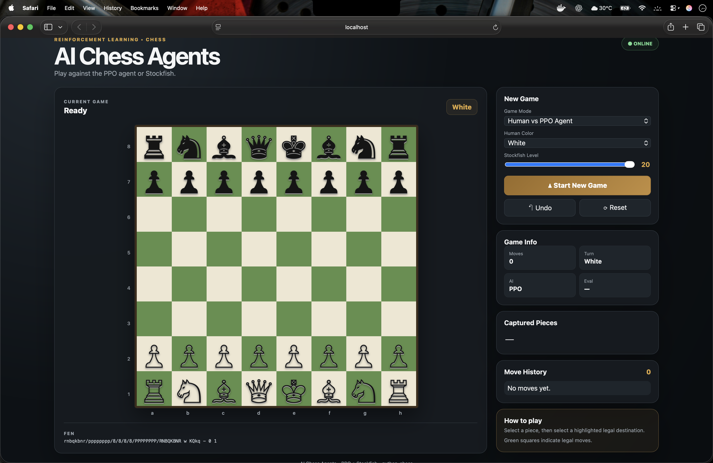
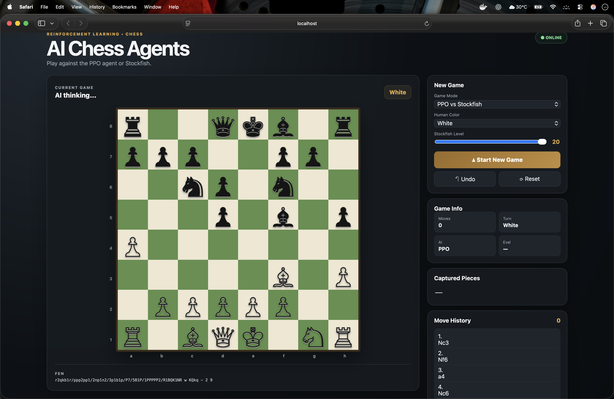

AI Chess Agent Project
Overview
This project implements a simple AI agent for playing chess using Reinforcement Learning (RL). It leverages the Gym library to create a custom chess environment and trains a Proximal Policy Optimization (PPO) model from the Stable Baselines3 library. The AI plays against the Stockfish chess engine (a strong open-source chess AI) as the opponent. The goal is to train an RL agent to make chess moves and learn from wins, losses, and draws.
The core of the project is a Jupyter Notebook (Colab-compatible) that handles package installation, environment setup, model training, and saving the trained model. This can serve as a starting point for experimenting with RL in board games like chess.
Key Features

Custom Gym Environment: Represents the chess board as an 8x8x12 observation space (one-hot encoded for 12 piece types).
Action Space: Discrete space with 4672 possible actions (maximum legal moves in chess; actions are mapped to actual legal moves).
Opponent: Stockfish engine plays as the black pieces, providing a challenging adversary.
Rewards:

+1 for checkmating the opponent (win).
-1 for being checkmated (loss).
+0.5 for draws (stalemate or insufficient material).
0 for ongoing games.

Training: Uses PPO algorithm with 50,000 timesteps (configurable).
Model Saving/Loading: Saves the trained model as chess_ai_agent.h5 for reuse.
Rendering: Displays the board state during gameplay.
## Screenshots

### Dashboard

The AI Chess Agents dashboard provides an interactive chess interface for playing against the PPO agent or Stockfish, with game controls, move history, captured pieces, and position information.

### AI vs AI

The AI vs AI mode allows the trained PPO agent to play against Stockfish automatically.

